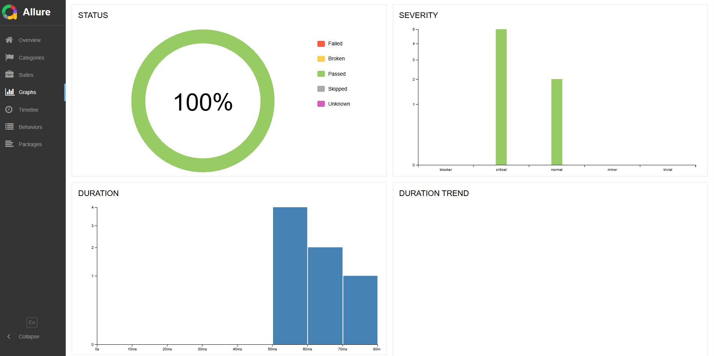
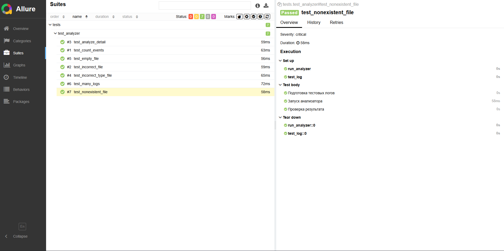

# Log Analyzer CLI 🛡️

Инструмент для генерации и автоматизированного анализа лог-файлов. Проект создан для демонстрации навыков QA Automation (Python).

## 📖 Описание проекта
Проект состоит из двух частей:
1. **Генератор логов**: Создает данные разного уровня важности (INFO, ERROR, FATAL и др.) для тестирования.
2. **CLI Анализатор**: Консольная утилита, которая считывает логи, проверяет их валидность, считает статистику и формирует финальный отчет в файл (report.txt).

## 🛠 Технологии
- **Язык**: Python 3.12
- **Тестирование**: Pytest
- **Отчетность**: Allure Framework
- **CI/CD**: GitHub Actions
- **Библиотеки/Модули**: Pytest, Allure, Pathlib, Argparse, Subprocess, Json, Datetime, Random

## 🧪 Качество и Тестирование (QA)
В этом проекте реализован полный цикл обеспечения качества:
- **Тест-дизайн**: В папке `QA_TESTS/` находятся 7 прописанных тест-кейсов (позитивные, негативные и граничные сценарии).
- **Баг-репортинг**: Документирование найденных в процессе разработки дефектов (см. `BUG_REPORTS.md`).
- **Автоматизация**: Все 7 сценариев покрыты автотестами на Pytest с использованием фикстур и фабрик.

### Отчет Allure
Результаты прогона тестов визуализированы с помощью Allure:



## ⚙️ CI/CD Пайплайн
Настроен автоматический запуск тестов при каждом `push` в ветку `main`.
- Статус последней сборки: [](https://github.com/HeavyHope/Log-Analyzer-CLI/actions/workflows/test_CI_CD.yml)

## 🚀 Как запустить и пользоваться

1. **Клонировать репозиторий**:
   ```bash
   git clone https://github.com/HeavyHope/Log-Analyzer-CLI.git
   cd Log-Analyzer-CLI
   ```

2. **Установить зависимости**:
   ```bash
   pip install -r requirements.txt
   ```
   
3. **Сгенерировать логи**:
   ```bash
   python log_gen.py # при каждом запуске генерирует новые логи, от кол-ва до значений 
    ```
4. **Проанализировать логи**:
   ```bash
   python log_analyzer.py # для изучения возможных флагов введите доп флаг -h
    ```
5. **Запуск автотестов и создание Allure отчётов**:
   ```bash
   pytest --alluredir=allure-results
    ```
6. **Запуск сервера с Allure отчетами**:
   ```bash
   allure serve allure-results
    ```